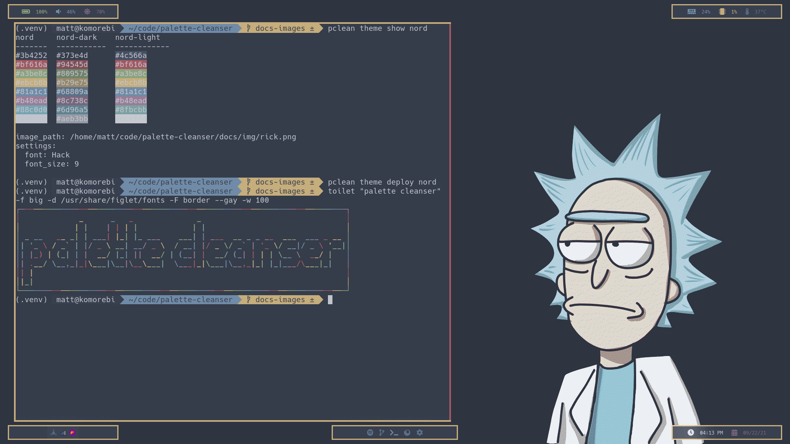

# Palette Cleanser



We all know that refreshing sensation of setting our desktop applications to a
delicious color scheme such as [Dracula](https://draculatheme.com/) or
[Nord](https://www.nordtheme.com/). But even the tastiest of color schemes can
grow bland after awhile, leaving you craving a new flavor for your desktop apps.

Palette Cleanser provides a means for storing your configuration files as
templates and your color palettes as deployable desktop themes so that you can
avoid the hassle of manually editing hex codes when switching your
applications to a new color scheme.

# Requirements

Python 3.9+

## Dependencies

* Jinja2 3.0.1+
* numpy 1.21.1+
* pywal 3.3.0+
* PyYAML 5.4.1+
* tabulate 0.8.9+
* typer 0.3.2+

# Installation

Install Palette Cleanser with pip:

``` sh
$ pip install [--user] palettecleanser
```

# Documentation

Check out the [wiki](https://github.com/mmuldo/palette-cleanser/wiki) for detailed documentation.

# Quickstart

Create a template:
``` sh
$ pclean template create .config/alacritty/alacritty.yml
```

Create a theme:
``` sh
$ pclean theme generate --from-image path/to/image --name my-clean-theme
```

Deploy a theme:
``` sh
$ pclean theme deploy my-clean-theme --template .config/alacritty/alacritty.yml
```

# Licence

This project is licensed under the terms of the MIT Licence.
